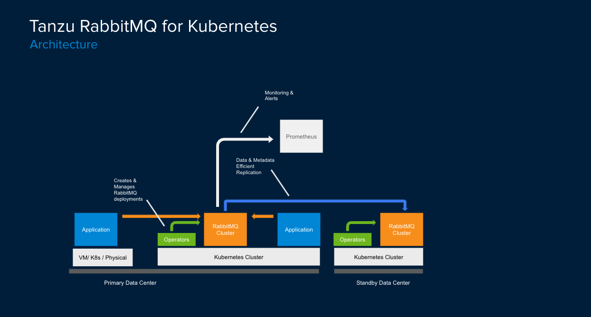

# tanzu-rabbitmq

# official docs to install Tanzu RabbitMQ
https://docs.vmware.com/en/VMware-Tanzu-RabbitMQ-for-Kubernetes/1.3/tanzu-rmq/GUID-installation.html

# Install Cluster Essentials
https://docs.vmware.com/en/Cluster-Essentials-for-VMware-Tanzu/1.2/cluster-essentials/GUID-deploy.html

# RabbitMQ Cluster Specs
https://blog.rabbitmq.com/posts/2020/04/quorum-queues-and-why-disks-matter/

# Cluster Specification
3 node clusters
Instance type: c4.4xlarge:
16 vCPUs
15GB RAM
2Gbps EBS instance throughput (the VM has a disk IO throughput ceiling of 2Gbps/250MBs)
5Gbps network (625MB/s)
All disks are either 200GB SSDs (io1) or 1TB HDDs (st1). Each has a larger throughput capacity than the c4.4xlarge EC2 instance can use.

Unique:

Store all data in a single drive
Cluster rabbitmq1, SSD1=data/logs/segment/wal
Cluster rabbitmq10, HDD1=data/logs/segment/wal
Store the WAL on a separate drive, but segment files on same drive as classic queue data
Cluster rabbitmq4, SSD1=data/logs/segment SSD2=wal
Cluster rabbitmq13, HDD1=data/logs/segment HDD2=wal
Assign classic queue data, segment files and WAL files their own dedicated drive each
Cluster rabbitmq7, SSD1=data/logs SSD2=segment SSD3=wal
Cluster rabbitmq16, HDD1=data/logs HDD2=segment HDD3=wal

